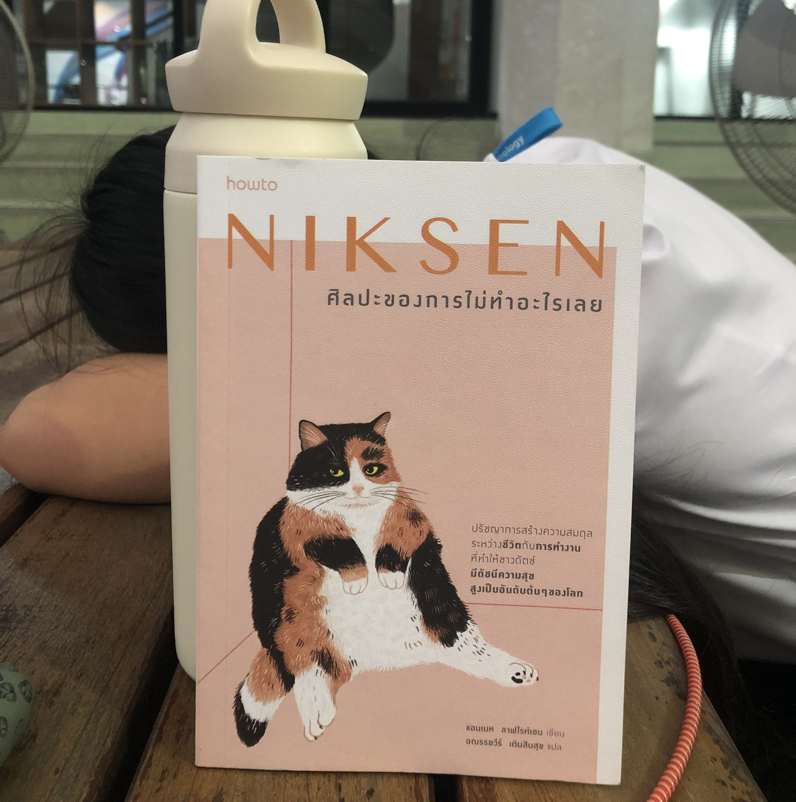

# Niksen

Created time: February 20, 2023 3:25 PM
Duration: 0
FinishedDate: February 20, 2023
StartedDate: February 20, 2023
Tags: Book, Non-fiction
isFinished: Yes

Niksen เป็นคำในภาษาดัตช์ มีความหมายว่า การไม่ทำอะไรเลย การอยู่เฉย ๆ หรือการทำอะไรโดยไม่เกิดประโยชน์ ซึ่งเป็นคำที่มีความหมายในแง่ที่ไม่ดีในสมัยก่อน เพราะมักใช้เรียกเหล่าคนที่มักทำตัวเฉื่อยชา ขวางโลก และไม่ทำอะไรที่มีแก่นสาร แต่นั่นเป็นเพราะว่าในสมัยก่อน ชาวดัตช์มีมุมมองการใช้ชีวิตที่ต่างจากปัจจุบันไปมาก พวกเขาเชื่อว่าการพยายามทำงานหนัก และฝักใฝ่ในการทำงานนั้นเป็นเรื่องที่น่ายกย่อง แต่เมื่อกาลเวลาผันผ่าน เทคโนโลยีและโซเชียลมีเดียได้สร้างผลกระทบเป็นอย่างมากกับมุมมองการใช้ชีวิตของชาวดัตช์ และวิถีชีวิตของพวกเขาได้เปลี่ยนแปลงไปนับแต่ตอนนั้น ในแบบหน้ามือเป็นหลังมือ ชาวดัตช์เริ่มมองหาความสงบในชีวิตมากขึ้น เพราะว่าเมื่อการเชื่อมต่อกับเหล่าผู้คนผ่านเทคโนโลยีเข้ามามีบทบาทในทุกส่วนของชีวิตเรามากขึ้น คำว่า Niksen หรือการพักผ่อนแบบที่ไม่ทำสิ่งใดเลย จึงเริ่มได้รับการยอมรับและเข้ามามีบทบาทในชีวิตของชาวดัตช์มากขึ้น

โดยที่หนังสือเล่มนี้ได้เล่าถึงปรัชญาและวิถีการใช้ชีวิตของชาวดัตช์ ที่มุ่งเน้นถึงการใช้ชีวิตให้มีคุณภาพมากที่สุด โดยการสอดแทรกการ Niksen เล็ก ๆ น้อย ๆ เข้าไปในหลาย ๆ ช่วงเวลาของชีวิตประจำวัน ตั้งแต่ระดับไม่กี่นาที ไปจนถึงระดับชั่วโมง ซึ่งการ Niksen ซึ่งเป็นการพักผ่อนที่**จะไม่ทำอะไรเลย** พักผ่อนในแบบที่เราจะไม่คิดเรื่องภาระงาน หน้าที่ หรือสิ่งที่เราต้องทำใด ๆ ทั้งสิ้น เป็นการที่เราได้พักผ่อนและขบคิดเกี่ยวกับสิ่งที่อยู่ต่อหน้า ซึ่งอาจจะเป็นการจ้องก้อนเมฆบนฟ้า มองแผงดอกไม้และใบหญ้าบนผืนดิน หรือการสังเกตเหล่าผู้คนที่เดินสัญจรผ่านไปและผ่านมา โดยถ้าเป็นการ Niksen ระหว่างวันทำงาน ก็อาจจะเป็นการพักผ่อนที่หลบการทำงานทั้งหมดออกมา แล้วใช้เวลาอยู่กับตัวเอง แต่แน่นอนว่าจะต้องเป็นในช่วงเวลาพัก การเอาเวลาทำงานมาพักผ่อนคงไม่ใช่เรื่องที่น่ายกย่องเท่าไรนัก ไม่ว่าจะเป็นสังคมไหน

ในท้ายที่สุด การมีวิถีชีวิตแบบชาวดัตช์ โดยการใช้ Niksen ในหลาย ๆ ส่วนของชีวิตประจำวัน แต่คงจะเป็นเรื่องยากหากจะนำมาปรับใช้กับชีวิตของชาวเอเชียทั่วไปที่ยังคงมีความเชื่อภาระงานนั้นมีความสำคัญ และเป็นสิ่งที่ต้องทำให้สำเร็จเป็นอันดับหนึ่ง ซึ่งสำคัญยิ่งกว่าการให้เวลาพักผ่อนกับตัวเอง แต่ทั้งนี้ทั้งนั้น แก่นที่สำคัญที่สุดของ Niksen ที่ผู้อ่านเข้าใจ ก็คือการให้ความสำคัญกับเวลาพักผ่อนมากกว่าเวลาทำงาน และจะต้องตั้งใจพักผ่อนให้เทียบเท่ากับการทำงานด้วยเช่นกัน การเปรยว่าตั้งใจพักผ่อนอาจจะฟังดูขัดกันในความหมายของตัวมัน แต่ความหมายจริง ๆ ก็คือการพักผ่อนและหยุดคำนึงถึงภาระต่าง ๆ ไปชั่วขณะ และคิดทบทวนเกี่ยวกับเรื่องของตัวเองต่างหาก เพราะขืนเรายังไม่ให้ความสำคัญกับเวลาพักผ่อนอย่างแท้จริง แอบขี้โกงเอาความคิดเรื่องงานมาคิดอย่างเป็นจริงเป็นจังในตอนพักผ่อน ก็เท่ากับว่าคุณไม่ได้ตั้งใจที่จะพักผ่อนอย่างจริงจัง

สุดท้ายนี้ การพักผ่อนและการทำงานมีความสำคัญในระดับที่ใกล้เคียงกัน แต่ในความเป็นจริงก็ไม่ใช่เรื่องง่าย จนถึงขั้นเป็นไปไม่ได้ด้วยซ้ำที่จะรักษาระดับความสำคัญของการพักผ่อนและการทำงานให้เท่ากันอยู่ตลอด จะต้องมีช่วงเวลาที่การทำงานมีความสำคัญมากกว่าการพักผ่อน จนคุณจะต้องทำงานหามรุ่งหามค่ำเป็นแน่ เมื่อช่วงเวลานั้นผ่านพ้นไป ขอให้คุณให้ความสำคัญกับเวลาพักผ่อนของคุณอีกครั้ง ลาก่อนจนกว่าจะพบกันใหม่
